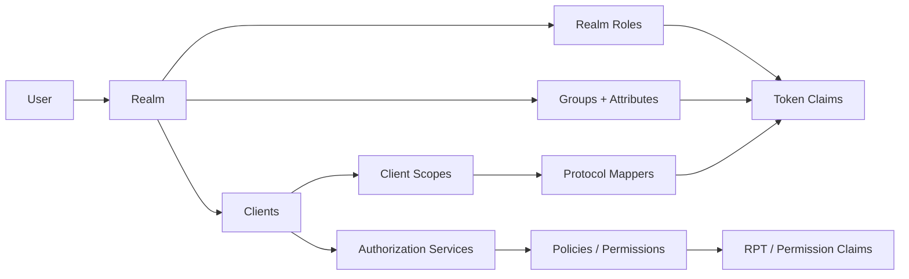

# SSO PRD

## 1. Belgenin amacı

Bu ürün gereksinimleri dokümanı, mevcut Spring Authorization Server örneğini güncel Keycloak yetenekleriyle karşılaştırır ve projede bulunmayan veya kısmen bulunan özellikler için uygulanabilir bir yol haritası tanımlar. Karşılaştırma, Keycloak Server Administration Guide 26.7.1, Authorization Services Guide, Protocol Mappers dokümantasyonu ve güncel feature kataloğuna dayanır.[^1][^2][^3][^4][^5]

Bu belge, Keycloak’ı birebir yeniden yazmayı hedeflemez. Hedef; mevcut uygulamanın güvenlik modelini koruyarak, ürün için anlamlı olan Keycloak yeteneklerini seçilebilir ve test edilebilir modüller halinde eklemektir.

## 2. Yönetici özeti

Proje bugün güçlü bir OAuth2/OIDC Authorization Server, özel Admin Console ve Account Console sunuyor. Authorization Code + PKCE, refresh token, client credentials, PAR, Device Authorization, introspection, revocation, OIDC logout, kullanıcı/grup/client yönetimi, consent, session yönetimi, audit event’leri, TOTP MFA ve recovery code akışları mevcut kodda bulunuyor.

Keycloak paritesindeki ana boşluklar şunlardır:

1. Realm ve çoklu tenant izolasyonu.
2. Realm role ile client role ayrımı, composite roller ve role scope mapping.
3. Protocol mapper altyapısı ve standart `realm_access` / `resource_access` token yapısı.
4. Grup attribute’ları, default groups ve client/scope bazlı grup claim’i.
5. Fine-grained admin permissions.
6. WebAuthn/passkeys, yapılandırılabilir authentication flow’ları ve reCAPTCHA.
7. OIDC/SAML identity brokering, LDAP/AD federation ve federated user mapper’ları.
8. Service account, offline access, standard token exchange, CIBA ve DPoP gibi ileri OAuth yetenekleri.
9. Authorization Services / UMA kaynak, scope, policy, permission ve RPT modeli.
10. Organizations, organization groups, invitation ve organization claim’leri.

TOTP ve recovery code eksik değildir; proje bunları kendi domain modeliyle uygular. Passkey/WebAuthn ise eksiktir. Bu ayrım, önceki değerlendirmelerdeki “MFA yok” varsayımını düzeltir.

## 3. Kapsam ve varsayımlar

### 3.1 Kapsam

Karşılaştırma aşağıdaki ürün alanlarını kapsar:

- realm ve yönetim modeli,
- kullanıcı, credential ve profil,
- gruplar ve grup mirası,
- realm/client rolleri,
- client, scope ve protocol mapper,
- OAuth2/OIDC/SAML akışları,
- token, session, consent ve logout,
- MFA ve authentication flow’ları,
- identity brokering ve user federation,
- fine-grained admin permissions,
- Authorization Services / UMA,
- Organizations,
- Admin REST ve Account Console yetenekleri,
- gözlemlenebilirlik ve genişletilebilirlik.

### 3.2 Kapsam dışı veya ayrı ürün kararı gerektiren alanlar

Keycloak’ın deployment ve platform özellikleri (multi-site, FIPS, DB sağlayıcıları, rolling update, OpenTelemetry, Kubernetes service account provider, Docker registry entegrasyonu), verifiable credentials/OID4VCI, SCIM, SSF ve preview özellikleri ayrı bir platform PRD’si gerektirir. Bu belgede bunlar “gelecekte değerlendirilecek” olarak listelenir; çekirdek kimlik ürününün ilk sürümüne zorunlu tutulmaz.

### 3.3 Proje baselini oluşturan kod alanları

Yerel taramada aşağıdaki mevcut yapılar esas alınmıştır:

- `domain/UserEntity`, `GroupEntity`, `AuthorityEntity`, `RegisteredClientEntity`, `ClientScopeEntity`, `AuthorizationEntity`;
- `config/security/AuthorizationServerConfig` ve `AdminApiSecurityConfig`;
- `service/admin/*` altında kullanıcı, grup, rol, client, scope, consent, session, event ve impersonation servisleri;
- `service/account/MfaService`, `RecoveryCodeService`, `MfaAuthorizationFilter`;
- `domain/LoginSettingsEntity`, `OAuth2KeyEntity`, `UserSessionEntity` ve required-action domain’i;
- `src/main/frontend/components/admin` ve `components/account` altında Admin/Account Console ekranları.

## 4. Özellik parite matrisi

Durumlar:

- **Var:** Ürün davranışı mevcut ve test edilebilir.
- **Kısmi:** Benzer davranış var, fakat Keycloak modeli, kapsamı veya token sözleşmesiyle aynı değil.
- **Eksik:** Kodda ürün özelliği bulunmuyor.
- **Opsiyonel:** Keycloak özelliği mevcut, fakat bu demo için ilk sürümde zorunlu değil.

### 4.1 Realm ve tenant yönetimi

| Özellik | Durum | Açıklama |
|---|---|---|
| Realm modeli | Eksik | Projede tek issuer ve tek kullanıcı alanı var. |
| Master realm | Eksik | Birden fazla realm’i yöneten üst seviye realm yok. |
| Realm’e özel client/rol/grup alanı | Eksik | Tüm yapılandırma uygulama geneline ait. |
| Realm ayarları | Kısmi | Login, password, OTP ve brute-force ayarları tek kayıt üzerinden yönetiliyor. |
| Realm default roles | Eksik | `default-roles-<realm>` modeli yok. |
| Realm export/import | Eksik | Realm konfigürasyon paketi yok. |
| Çoklu tenant izolasyonu | Eksik | Tenant bazlı veri, cache ve authorization ayrımı yok. |
| Realm bazlı admin | Eksik | `master` realm ve realm-specific admin rol modeli yok. |

Keycloak’ta realm, kullanıcıları, credential’ları, rolleri, grupları ve client’ları izole eden temel sınırdır. `master` realm farklı realm’leri yönetebilir.[^1]

### 4.2 Kullanıcı ve profil

| Özellik | Durum | Açıklama |
|---|---|---|
| Kullanıcı CRUD | Var | Admin API ve ekranları mevcut. |
| Kullanıcı aktivasyonu | Var | Enabled/disabled yönetimi mevcut. |
| Kullanıcı profili | Kısmi | Sabit kolonlar var; dinamik attribute map yok. |
| E-posta doğrulama | Var | Doğrulama ve yeniden gönderme akışları mevcut. |
| Şifre değiştirme/sıfırlama | Var | Account ve admin akışları mevcut. |
| Şifre geçmişi ve sona erme | Var | Login settings ile yapılandırılıyor. |
| Brute-force ve hesap kilidi | Var | Uygulama içi policy ve kilit servisi mevcut. |
| Kullanıcı attribute’ları | Eksik | Keycloak’taki çok değerli serbest attribute modeli yok. |
| Kullanıcı credential listesi | Kısmi | TOTP bilgisi yönetiliyor; genel credential koleksiyonu yok. |
| Kullanıcı import/export | Eksik | Toplu kullanıcı yaşam döngüsü yok. |
| Kullanıcı account linking | Eksik | Harici identity ile hesap bağlama yok. |
| Kullanıcı impersonation | Var | Admin-only tek kullanımlık ticket akışı mevcut. |

### 4.3 Credential ve MFA

| Özellik | Durum | Açıklama |
|---|---|---|
| Password | Var | BCrypt ve password policy mevcut. |
| TOTP enrollment | Var | QR/otpauth üretimi ve kod doğrulama mevcut. |
| TOTP zorunluluğu | Var | Login settings ve authorization öncesi MFA kontrolü mevcut. |
| Recovery codes | Var | Tek kullanımlık hash’lenmiş kodlar mevcut. |
| MFA brute-force | Var | MFA özel başarısız deneme ve kilit servisi mevcut. |
| Step-up authentication | Kısmi | OAuth authorization öncesinde TOTP doğrulaması var; Keycloak’ın genel flow/credential koşulları yok. |
| WebAuthn | Eksik | Public-key credential kaydı ve doğrulaması yok. |
| Passkeys | Eksik | Passwordless veya conditional UI desteği yok. |
| SMS/voice OTP | Eksik | Provider ve güvenilir kanal modeli yok. |
| Backup credential yönetimi | Kısmi | Recovery code var; credential cihaz listesi yok. |
| Passwordless akış | Eksik | Passkey/WebAuthn tabanlı passwordless login yok. |

Keycloak’ın güncel feature kataloğunda Passkeys, WebAuthn, recovery codes ve step-up authentication ayrı yetenekler olarak yer alır.[^5] Projede recovery code ve TOTP vardır; WebAuthn/passkeys ayrıca geliştirilmelidir.

### 4.4 Gruplar

| Özellik | Durum | Açıklama |
|---|---|---|
| Grup CRUD | Var | Admin API ve UI mevcut. |
| Grup üyeliği | Var | Kullanıcı ekleme/çıkarma mevcut. |
| Hiyerarşik gruplar | Var | `parent_id` ve path üretimi mevcut. |
| Parent rol mirası | Var | Etkin roller üst grup zincirinden hesaplanıyor. |
| Grup role mapping | Var | Grup rollerini değiştirme endpoint’i mevcut. |
| Grup path claim’i | Kısmi | `groups` claim’i sadece `admin-console` access token’ında. |
| Grup attribute’ları | Eksik | `GroupEntity` attribute alanı içermiyor. |
| Default groups | Eksik | Yeni kullanıcıya otomatik grup ataması yok. |
| Group membership mapper | Eksik | Claim üretimi client scope/protocol mapper ile yapılandırılmıyor. |
| Organization groups | Eksik | Organization’a bağlı ayrı grup alanı yok. |
| Grup bazlı ince admin yetkisi | Eksik | Grup bazında `view`, `manage`, `view-members`, `manage-members`, `manage-membership` ayrımı yok. |

Keycloak grupları kullanıcı attribute’larını ve role mapping’lerini miraslandırır; default groups yeni veya broker üzerinden gelen kullanıcıları otomatik gruplandırır.[^6]

### 4.5 Roller ve yetki modeli

Mevcut uygulama rolleri:

```text
ROLE_ADMIN
ROLE_USER
ROLE_USER_VIEWER
ROLE_USER_MANAGER
ROLE_CLIENT_VIEWER
ROLE_CLIENT_MANAGER
ROLE_EVENT_VIEWER
ROLE_EVENT_MANAGER
```

| Keycloak yeteneği | Durum | Açıklama |
|---|---|---|
| Realm role | Kısmi | `AuthorityEntity` global role gibi çalışıyor. |
| Client role | Eksik | Role client namespace’i yok. |
| Client role-user mapping | Eksik | Kullanıcı-client rol ilişkisi yok. |
| Client role-group mapping | Eksik | Grup-client rol ilişkisi yok. |
| Composite role | Eksik | Rolün başka rolleri içermesi desteklenmiyor. |
| Role inheritance | Kısmi | Grup parent mirası var; composite role modeli yok. |
| Role scope mapping | Eksik | Client scope’un izin verdiği rol kümesi yok. |
| Full scope allowed/downscoping | Eksik | Token rol kapsamı client bazında daraltılmıyor. |
| `realm_access.roles` | Eksik | Özel `roles` claim’i kullanılıyor. |
| `resource_access.<client>.roles` | Eksik | Client role claim’i yok. |
| `query-users` | Eksik | Ayrı authority adı yok. |
| `query-groups` | Eksik | Ayrı authority adı yok. |
| `query-clients` | Eksik | Ayrı authority adı yok. |
| `manage-users` | Kısmi | `ROLE_USER_MANAGER` yaklaşık karşılık. |
| `manage-clients` | Kısmi | `ROLE_CLIENT_MANAGER` yaklaşık karşılık. |
| `view-users` | Kısmi | `ROLE_USER_VIEWER` yaklaşık karşılık. |
| `view-clients` | Kısmi | `ROLE_CLIENT_VIEWER` yaklaşık karşılık. |
| `manage-events` / `view-events` | Var | `ROLE_EVENT_VIEWER` ve `ROLE_EVENT_MANAGER` tanımlı. Listeleme/detay endpoint’leri `view` ile, tüm event kayıtlarını silme ve event ayarlarını güncelleme endpoint’leri `manage` ile korunuyor. Proje Keycloak’taki ayrı user-event provider/listener modelini içermez. |
| `manage-realm` | Eksik | Realm ayarı yetkisi yok. |
| `manage-identity-providers` | Eksik | IdP yönetimi yok. |
| `manage-organizations` | Eksik | Organization yönetimi yok. |

Güncel Keycloak `realm-management` rollerinde `create-client`, `manage-clients`, `manage-users`, `query-groups`, `view-users` gibi roller vardır.[^1] `manage-groups` adı güncel resmi realm-management rol listesinde ayrı bir rol değildir; grup yönetimi fine-grained permission kapsamlarıyla modellenir.[^7]

### 4.6 Client, scope ve protocol mapper

| Özellik | Durum | Açıklama |
|---|---|---|
| Client CRUD | Var | Admin API/UI mevcut. |
| Client secret rotation | Kısmi | Secret yenileme var; Keycloak’ın rotation policy modeli yok. |
| Redirect URI/post logout URI | Var | Client modelinde mevcut. |
| Grant type yönetimi | Var | Registered client ayarları mevcut. |
| Client scope CRUD | Var | `ClientScopeEntity` ve admin ekranları mevcut. |
| Default/optional scope ataması | Var | Client scope assignment mevcut. |
| Protocol mapper CRUD | Eksik | Mapper entity, config ve admin ekranı yok. |
| User attribute mapper | Eksik | Dinamik attribute’ı claim’e bağlama yok. |
| Group mapper | Eksik | Group claim’i kod içinde sabit üretiliyor. |
| Role mapper | Eksik | Realm/client rollerini standart claim’e map etme yok. |
| Audience mapper | Eksik | Client role veya mapper üzerinden audience yönetimi yok. |
| Pairwise subject mapper | Eksik | Client bazlı subject pseudonymization yok. |
| Script mapper | Eksik | Script tabanlı token mapper yok. |
| Mapper SPI | Eksik | Keycloak benzeri provider extension noktası yok. |
| Scope evaluation/preview | Eksik | Etkin mapper ve rol kapsamını test eden ekran yok. |
| Parameterized scopes | Eksik | Dinamik scope parametreleri yok. |

Keycloak protocol mapper’ları kullanıcı attribute’larını, rollerini ve diğer verileri OIDC token’larına veya SAML assertion’larına taşır; REST API üzerinden oluşturulup yönetilebilir.[^3]

### 4.7 Token ve OAuth/OIDC protokolleri

| Özellik | Durum | Açıklama |
|---|---|---|
| Authorization Code + PKCE | Var | Console client’ları kullanıyor. |
| Refresh token | Var | Rotation ve browser persistence mevcut. |
| Client Credentials | Var | Seed client ve integration test mevcut. |
| PAR | Var | Endpoint yapılandırılmış. |
| Device Authorization | Var | Device code persistence ve verification mevcut. |
| Introspection | Var | Endpoint mevcut. |
| Revocation | Var | Endpoint mevcut. |
| OIDC Discovery | Var | Metadata endpoint mevcut. |
| JWK Set/key rotation | Var | DB-backed key service mevcut. |
| OIDC UserInfo | Var | OIDC config ile etkin. |
| OIDC logout/session status | Var | Session identifier ve logout akışları mevcut. |
| Direct Access Grant | Eksik | Password grant akışı yok. |
| Standard Token Exchange | Eksik | `token-exchange` grant’i yok. |
| CIBA | Eksik | Backchannel authentication yok. |
| DPoP | Eksik | Proof-of-possession token yok. |
| Resource Indicators | Eksik | `resource` parametresi ile audience/downscope yok. |
| JWT Authorization Grant | Eksik | JWT assertion grant’i yok. |
| Offline access | Eksik | `offline_access`, offline session ve offline token yok. |
| Service account | Eksik | Her client için özel service-account user modeli yok. |
| Lightweight access token | Eksik | Token içeriğini server-side çözümleme modeli yok. |
| SAML 2.0 | Eksik | SAML IdP/SP ve assertion üretimi yok. |

Keycloak standard token exchange ile bir client’a verilen token’ın başka bir hedef client için token’a dönüştürülmesini destekler; proje bu grant’i sunmuyor.[^4] Offline token, normal refresh token’dan farklı olarak logout sonrasında da kullanılabilir ve ayrı timeout/revocation politikaları taşır.[^1]

### 4.8 Authentication flow ve required action

| Özellik | Durum | Açıklama |
|---|---|---|
| Form login | Var | Spring Security login akışı mevcut. |
| Registration | Var | Account registration endpoint/UI mevcut. |
| Forgot password | Var | E-posta action token akışı mevcut. |
| Email verification | Var | Required action/action token mevcut. |
| Required action definitions | Var | DB-backed ve admin yönetilebilir. |
| TOTP required action | Var | Custom required action mevcut. |
| Recovery code action | Var | Custom required action mevcut. |
| Browser flow editor | Eksik | Akışlar veritabanında dinamik execution graph olarak modellenmiyor. |
| Registration flow editor | Eksik | Adım ve koşul yönetimi yok. |
| First broker login flow | Eksik | Federation olmadığı için yok. |
| Conditional sub-flow | Kısmi | MFA authorization filter var; genel conditional flow engine yok. |
| reCAPTCHA | Eksik | Registration/login bot koruması yok. |
| Identity-first login | Eksik | Önce e-posta/username ile IdP seçimi yok. |
| Passkey/WebAuthn flow | Eksik | WebAuthn authenticator execution yok. |
| Custom authenticator SPI | Eksik | Provider/flow extension API yok. |

Keycloak authentication flows; login, registration, credential reset ve reCAPTCHA gibi adımların sıralı/koşullu biçimde yapılandırılmasını sağlar.[^8]

### 4.9 Identity brokering ve user federation

| Özellik | Durum |
|---|---|
| External OIDC IdP | Eksik |
| External SAML IdP | Eksik |
| Social login | Eksik |
| OAuth2 identity broker | Eksik |
| LDAP federation | Eksik |
| Active Directory federation | Eksik |
| Kerberos | Eksik |
| FreeIPA/SSSD | Eksik |
| User federation sync | Eksik |
| Identity provider mapper | Eksik |
| LDAP group mapper | Eksik |
| Account linking | Eksik |
| First-login account creation | Eksik |
| External token retrieval | Eksik |
| Broker logout | Eksik |

Keycloak LDAP/AD provider’ları, harici kullanıcı depolarını realm’e bağlar; OIDC ve SAML identity provider’ları ise harici kimlikleri broker olarak kullanır.[^9] Projede `DomainUserDetailsService` yalnızca yerel JPA kullanıcı modelini yükler.

### 4.10 Session, consent, event ve notification

| Özellik | Durum | Açıklama |
|---|---|---|
| Online user session | Var | JPA session repository mevcut. |
| Kullanıcı session listesi | Var | Account Console mevcut. |
| Admin session listesi | Var | Admin Console mevcut. |
| Session revoke | Var | Kullanıcı/admin kapatma işlemleri mevcut. |
| OAuth authorization persistence | Var | `oauth2_authorization` mevcut. |
| Consent persistence/revoke | Var | Admin ve Account Console mevcut. |
| Admin audit events | Var | Admin event entity/service/controller mevcut. |
| User event stream | Kısmi | Authentication event’leri uygulama servisine bağlı; Keycloak event tipi/filtreleri yok. |
| Event listener provider | Eksik | SPI/webhook/event listener registry yok. |
| Event metrics | Eksik | Keycloak user-event-metrics karşılığı yok. |
| Offline sessions | Eksik | Offline token/session ekranı yok. |
| Not-before revocation | Eksik | Realm/client/user seviyesinde standart policy yok. |
| Email/SMS event delivery | Kısmi | E-posta action’ları var; genel event delivery yok. |

Keycloak Admin REST API event yönetimini ayrı event CRUD modeli olarak değil, audit kayıtlarını sorgulama/silme ve event provider yapılandırması olarak sunar: `GET/DELETE /admin/realms/{realm}/admin-events`, `GET/DELETE /admin/realms/{realm}/events` ve `GET/PUT /admin/realms/{realm}/events/config`.[^12]

### 4.11 Fine-grained admin permissions

| Kaynak | Keycloak kapsamları | Projedeki durum |
|---|---|---|
| User | `view`, `manage`, `map-roles`, `manage-group-membership`, `impersonate` | Kısmi; global `ROLE_*` ve endpoint matcher’ları var |
| Group | `view`, `manage`, `view-members`, `manage-members`, `manage-membership` | Eksik; grup bazlı policy yok |
| Client | `view`, `manage`, `map-roles`, `map-roles-composite`, `map-roles-client-scope` | Kısmi; client manager/viewer var |
| Role | `view`, `manage`, `map-roles` | Eksik; role resource permission yok |
| Organization | `view`, `manage`, `view-members`, `manage-members`, `manage-membership` | Eksik |
| Event | `view`, `manage` | Kısmi; `ROLE_EVENT_VIEWER` ve `ROLE_EVENT_MANAGER` ile global endpoint yetkilendirmesi var, kaynak bazlı fine-grained permission modeli yok |

Keycloak fine-grained admin modelinde yetki, kullanıcının genel rolünden bağımsız olarak belirli kaynak ve işlem kapsamına bağlanabilir.[^10] Projede backend endpoint yetkilendirmesi güvenli olsa da aynı rol, tüm kaynaklar üzerinde global etki yaratır.

### 4.12 Organizations

| Özellik | Durum |
|---|---|
| Organization CRUD | Eksik |
| Organization attribute’ları | Eksik |
| Organization domain mapping | Eksik |
| Organization invitation | Eksik |
| Organization membership | Eksik |
| Organization identity provider | Eksik |
| Organization groups | Eksik |
| Organization claim’leri | Eksik |
| Organization admin policies | Eksik |

Keycloak Organizations realm içinde B2B üyelik, domain eşleme, invitation, identity provider ve organization group yönetimi sağlar.[^11] Demo tek uygulama/tek kullanıcı alanı olduğu için bu alan ilk sürüm zorunluluğu değildir.

### 4.13 Authorization Services / UMA

| Özellik | Durum |
|---|---|
| Resource server registration | Eksik |
| Protected resource | Eksik |
| Authorization scope | Kısmi; OAuth client scope var, resource authorization scope yok |
| Role policy | Eksik |
| Group policy | Eksik |
| User policy | Eksik |
| Client policy | Eksik |
| Attribute/context policy | Eksik |
| JavaScript policy | Eksik |
| Permission | Eksik |
| UMA permission ticket | Eksik |
| RPT | Eksik |
| Policy evaluation | Eksik |
| Policy Enforcement Point | Eksik |

Keycloak Authorization Services kaynak, scope, policy ve permission’ları birleştirerek RPT üretir; UMA Protection API ile resource server’ların kaynak ve permission ticket yönetmesine izin verir.[^2] Mevcut proje ise endpoint erişimini JWT authority ve Spring Security matcher’larıyla çözüyor.

### 4.14 UI, Admin REST ve genişletilebilirlik

| Özellik | Durum |
|---|---|
| Admin Console | Kısmi; projeye özel Next.js console var |
| Account Console | Kısmi; projeye özel console var |
| Keycloak Admin REST uyumluluğu | Eksik; özel `/api/admin` sözleşmesi kullanılıyor |
| Admin REST pagination/filter | Var; proje kendi API sözleşmesini kullanıyor |
| Theme customization | Kısmi; frontend theme switcher/i18n var, Keycloak theme SPI yok |
| Internationalization | Var; Türkçe/İngilizce mevcut |
| Admin API OpenAPI | Var |
| Keycloak Java Admin Client uyumluluğu | Eksik |
| SPI/provider extension | Eksik |
| Custom storage provider | Eksik; JPA doğrudan uygulama domain’ine bağlı |
| Custom protocol mapper provider | Eksik |
| Custom authenticator provider | Eksik |
| Custom event listener provider | Eksik |
| SCIM provisioning API | Eksik |

## 5. Önerilen ürün hedefi

### 5.1 Hedef mimari

İlk hedef Keycloak’ın tüm özelliklerini kopyalamak değil, mevcut uygulamayı **Keycloak uyumlu kimlik ve yetki çekirdeği** haline getirmektir:



### 5.2 İlk sürümde korunacak mevcut sözleşmeler

- `ROLE_ADMIN`, `ROLE_USER`, `ROLE_USER_VIEWER`, `ROLE_USER_MANAGER`, `ROLE_CLIENT_VIEWER`, `ROLE_CLIENT_MANAGER` silinmeyecek.
- Mevcut özel `roles` claim’i geriye dönük uyumluluk için korunacak.
- Yeni standart claim’ler önce eklenerek tüketicilerin geçişi sağlanacak.
- Mevcut `/api/admin` ve `/api/account` endpoint’leri kırılmayacak.
- Kullanıcı/grup/rol/credential değişiklikleri session ve authorization invalidation kurallarını koruyacak.
- Mevcut TOTP, recovery code, consent, session ve audit davranışı yeni modele taşınacak.

## 6. Ürün gereksinimleri

### EPIC-01 — Realm ve tenant çekirdeği

**Öncelik:** P1, çoklu tenant gereksinimi doğrulanırsa P0.

**Amaç:** Kullanıcı, client, grup, rol, scope ve credential verisini realm sınırında izole etmek.

**Gereksinimler**

- `realms` tablosu; realm adı, issuer, durum, display name ve ayar JSON’u.
- Kullanıcı, grup, rol, client, scope, event ve session kayıtlarında `realm_id`.
- Realm başına bağımsız default roles ve default groups.
- Realm başına login/password/OTP/brute-force policy.
- Realm yöneticisi ve sistem yöneticisi ayrımı.
- Realm silme için cascade ve audit politikası.
- Tek realm kurulumundan çoklu realm’e veri migration komutu.

**Kabul kriterleri**

- Realm A kullanıcısı Realm B client’ına erişemez.
- Aynı client ID iki realm’de çakışmadan kullanılabilir.
- Token issuer ve discovery URL realm’e göre değişir.
- Cache anahtarları realm sınırını içerir.
- Realm silme geri döndürülemez işlem olarak audit edilir.

### EPIC-02 — Realm role, client role ve composite role modeli

**Öncelik:** P0.

**Amaç:** Mevcut global `AuthorityEntity` modelini Keycloak benzeri role namespace’lerine ayırmak.

**Gereksinimler**

- `roles` tablosu: `realm_id`, `client_id nullable`, `name`, `description`, `role_type`.
- Realm role ve client role aynı isimle farklı namespace’lerde bulunabilir.
- User-role ve group-role mapping’leri role ID üzerinden tutulur.
- Composite role üyelik tablosu ve cycle detection.
- Etkin role hesaplama direct + group inherited + composite rollerden oluşur.
- Mevcut altı `ROLE_*` değeri migration ile realm role olarak korunur.
- `ROLE_CLIENT_*` için product kararı: realm role olarak kalabilir veya belirli client role’larına ayrılabilir; varsayılan migration geriye dönük uyumluluk için realm role olarak başlamalıdır.

**Kabul kriterleri**

- Composite role cycle oluşturulamaz.
- Bir kullanıcı role’ü doğrudan, grup üzerinden veya composite üzerinden aldığı zaman etkin role aynı sonucu verir.
- Rol silme, mapping ve composite ilişkileriyle birlikte güvenli biçimde doğrulanır.
- Role değişikliği etkilenen kullanıcıların session/token’larını invalidate eder.

### EPIC-03 — Standart token role claim’leri ve scope filtering

**Öncelik:** P0.

**Gereksinimler**

- `realm_access.roles` claim’i realm rollerini taşır.
- `resource_access.<clientId>.roles` claim’i client rollerini taşır.
- Eski `roles` claim’i geçiş süresince korunur.
- Client scope role mapping’leriyle kullanıcı rolü ile izin verilen rolün kesişimi hesaplanır.
- `aud` claim’i client role veya audience mapper mantığıyla üretilebilir.
- Access token, ID token ve UserInfo için claim inclusion seçenekleri ayrı tutulur.
- Claim üretimi client ve client scope üzerinden seçilebilir hale gelir.

**Kabul kriterleri**

- Client A token’ında Client B rolü varsayılan olarak görünmez.
- Scope mapping ile izin verilmeyen realm/client rolü token’a eklenmez.
- Group role mirası standart role claim’lerine yansır.
- Admin role’leri uygulama token’ına otomatik sızmaz; admin API yetkisi ile resource API yetkisi ayrılır.

### EPIC-04 — Protocol mapper ve dinamik user/group attribute

**Öncelik:** P0.

**Gereksinimler**

- `user_attributes` ve `group_attributes` çok değerli key/value modeli.
- Client veya client scope altında protocol mapper tanımı.
- İlk mapper türleri: user attribute, group membership, realm role, client role, audience, email, username, subject.
- Mapper config’i JSON olarak saklanmalı; desteklenen mapper türleri allowlist ile sınırlandırılmalı.
- Token type ve claim destination ayrı seçilebilmeli.
- Mapper evaluation ekranı oluşturulmalı.
- Script mapper ilk sürümde desteklenmemeli; güvenlik incelemesine bağlı ayrı karar olmalı.

**Kabul kriterleri**

- Admin, `department=finance` attribute’unu `department` claim’ine bağlayabilir.
- Group mapper `/Engineering/Backend` gibi path’leri seçilen client’ların token’ına ekleyebilir.
- Mapper değişikliği yeni token üretiminde etkili olur ve audit edilir.
- Mapper ile secret, password hash veya MFA secret token’a taşınamaz.

### EPIC-05 — Grup attribute, default group ve fine-grained group permission

**Öncelik:** P0.

**Gereksinimler**

- Grup attribute CRUD ve çok değerli attribute desteği.
- Realm default groups listesi.
- Yeni local kullanıcıya default group ataması.
- Federation eklendiğinde import edilen kullanıcıya default group ataması.
- Grup bazında `view`, `manage`, `view-members`, `manage-members`, `manage-membership` permission’ları.
- Grup role mapping ve group membership değişikliğinde session invalidation.
- Grup detail DTO’sunda direct role ve effective inherited role ayrımı.

**Kabul kriterleri**

- Parent group attribute ve role mapping child üyeye etkin olarak yansır.
- Default group’tan çıkarılan kullanıcıya yeni token’da grup claim’i verilmez.
- Grup yöneticisi yalnızca izin verilen grup ağacında üye ve rol değiştirebilir.
- `groups` claim’i admin-console’a özel hard-code olmaktan çıkar; client scope ile seçilebilir.

### EPIC-06 — Fine-grained admin authorization

**Öncelik:** P0.

**Gereksinimler**

- Resource type: user, group, client, role, organization, event.
- Scope type: view, manage ve kaynak özel işlemler.
- Policy: role, group, user ve attribute tabanlı başlangıç türleri.
- Permission evaluation service ve centralized authorization decision.
- UI’de yetki verilmeyen kaynaklar görünür olmamalı veya salt okunur gösterilmeli.
- Endpoint matcher’ları permission service sonucuyla uyumlu kalmalı.

**Kabul kriterleri**

- `ROLE_USER_MANAGER`, sadece izin verilen user resource set’i üzerinde manage yapabilir.
- `ROLE_CLIENT_VIEWER`, client role mapping veya secret rotation yapamaz.
- Grup yöneticisi başka grubun üyelerini okuyamaz.
- `view-events` yalnızca event listeleme ve detay endpoint’lerine, `manage-events` ise event yönetimi bulunan mutasyon endpoint’lerine atanır.
- Frontend’de butonu gizlemek tek güvenlik kontrolü olarak kullanılmaz.

### EPIC-07 — WebAuthn, passkeys ve authentication flow engine

**Öncelik:** P1.

**Gereksinimler**

- WebAuthn credential registration, list, rename ve revoke.
- Passkey passwordless ve conditional UI akışı.
- Credential reset required action.
- TOTP ve passkey’nin conditional/alternative/required kombinasyonları.
- Browser, registration, first-login ve reset flow tanımlarının versiyonlanabilir modeli.
- reCAPTCHA execution için provider abstraction.
- Step-up politikasının client/scope/resource bazında seçilebilmesi.

**Kabul kriterleri**

- Kullanıcı Account Console’dan passkey ekleyebilir ve silebilir.
- Admin passkey credential metadata’sını görebilir ama private key okuyamaz.
- Passkey ile başarılı authentication sonrası gereksiz OTP sorulmaz; policy required ise sorulur.
- Flow değişikliği mevcut session’ları beklenmedik şekilde açık bırakmaz.

### EPIC-08 — Identity brokering ve user federation

**Öncelik:** P1, kurumsal müşteri ihtiyacı varsa P0.

**Gereksinimler**

- OIDC provider configuration.
- SAML provider configuration.
- LDAP/AD provider configuration ve sync policy.
- Provider mapper: username, email, group, role, attribute.
- İlk login account linking ve duplicate user policy.
- Provider token saklama/şifreleme ve logout.
- Federation kullanıcılarında local override ve read-only alan politikası.
- Sync job, manuel sync ve hata audit’i.

**Kabul kriterleri**

- Harici OIDC kullanıcı ilk login’de güvenli şekilde local user’a bağlanır.
- Aynı e-posta için otomatik birleştirme varsayılan olarak kapalıdır.
- LDAP sync group membership ve disable durumunu belirlenen policy’ye göre günceller.
- Provider secret’ları log ve token’larda görünmez.

### EPIC-09 — Service account ve offline access

**Öncelik:** P1.

**Gereksinimler**

- Confidential client başına service account principal.
- Service account role mapping ve client scope kontrolü.
- `offline_access` realm role ve scope.
- Offline authorization/session persistence.
- Offline token revoke ve client/user ekranları.
- Refresh token rotation ile offline token rotation ayrımı.

**Kabul kriterleri**

- Service account token’ı insan kullanıcı gruplarını içermez.
- Offline token normal logout sonrası policy’ye uygun çalışır.
- Admin belirli kullanıcı veya client’ın offline grant’ini iptal edebilir.
- Offline token veritabanında şifrelenmiş veya hash’lenmiş biçimde tutulur.

### EPIC-10 — Standard token exchange, CIBA ve DPoP

**Öncelik:** P2.

**Gereksinimler**

- Standard token exchange V2: subject token, audience ve requested token policy.
- CIBA için backchannel authentication request, polling/push ve user interaction.
- DPoP key binding, nonce ve replay protection.
- Grant bazlı client enablement ve audit event’leri.

**Kabul kriterleri**

- Token exchange yalnızca izin verilen target client’a token üretir.
- DPoP token bearer olarak kullanılamaz.
- CIBA isteği süresi dolunca access token üretilemez.
- Yeni grant’ler discovery metadata’da doğru şekilde ilan edilir.

### EPIC-11 — Authorization Services / UMA

**Öncelik:** P2.

**Gereksinimler**

- Resource server registration.
- Resource ve scope CRUD.
- Role, group, user, client, attribute, time ve JavaScript policy seçenekleri.
- Permission oluşturma ve evaluation.
- UMA permission ticket ve RPT.
- Protection API için client authentication ve rate limit.
- Spring Resource Server tarafında policy enforcement integration.

**Kabul kriterleri**

- Bir kaynağın `read` ve `write` scope’ları farklı policy’lerle yönetilir.
- User/group/role değişikliği daha önce verilmiş permission token’larının geçerlilik politikasını uygular.
- Policy evaluation sonucu audit edilebilir.
- Resource server, merkezi policy kararını endpoint erişiminde kullanabilir.

### EPIC-12 — Organizations

**Öncelik:** P2.

**Gereksinimler**

- Organization CRUD ve attribute’ları.
- Domain ve wildcard domain mapping.
- Invitation lifecycle.
- Organization member roles.
- Organization-specific IdP.
- Organization groups ve group role mappings.
- Organization claim mapper.
- Organization admin permissions.

**Kabul kriterleri**

- Aynı e-posta domain’ine göre doğru organization seçilir.
- Invitation tek kullanımlı ve süreli olur.
- Organization grupları realm gruplarıyla namespace çakışmasına girmez.
- Organization dışındaki admin ilgili üyeleri göremez.

### EPIC-13 — SAML, SCIM, OID4VCI ve genişletilebilirlik

**Öncelik:** P3 veya ayrı ürün paketleri.

**Gereksinimler**

- SAML SP/IdP ve assertion mapper.
- SCIM user/group provisioning.
- OID4VCI credential issuance.
- Shared Signals Framework event delivery.
- SPI benzeri extension contracts.
- Provider lifecycle, versioning ve sandboxing.

Bu epic, ürünün temel Authorization Server kapsamından büyümesi durumunda ayrı roadmap’e taşınmalıdır.

## 7. Veri modeli önerisi

İlk iki epic için önerilen çekirdek tablolar:

```text
realms
  └── users
  └── groups
  └── roles
        └── role_composites
  └── clients
        └── client_scopes
              └── protocol_mappers
  └── user_role_mappings
  └── group_role_mappings
  └── user_attributes
  └── group_attributes
  └── admin_resources
        └── admin_permissions
              └── admin_policies
```

### 7.1 Migration ilkeleri

- Mevcut `AuthorityEntity` satırları ilk migration’da realm role olarak taşınmalı.
- Mevcut `user_authorities` ilişkisi `user_role_mappings` tablosuna taşınmalı.
- `group_authorities` ilişkisi `group_role_mappings` tablosuna taşınmalı.
- Existing `ROLE_*` adları korunmalı; isim normalizasyonu ayrı migration olmalı.
- Yeni tabloların foreign key kolonları ve sık kullanılan birleşik filtreleri aynı Liquibase create changelog’ında indekslenmeli.
- Migration sırasında kullanıcıların etkin rol kümesi önce ve sonra karşılaştırılmalı.
- Her yetki değişikliği mevcut `UserAccessInvalidationService` ile aynı transaction içinde session/OAuth authorization invalidation yapmalı.

## 8. API ve ekran gereksinimleri

### 8.1 Önerilen API alanları

```text
GET/POST /api/admin/realms
GET/PUT /api/admin/realms/{realm}

GET/POST /api/admin/roles
GET/PUT/DELETE /api/admin/roles/{id}
GET/PUT /api/admin/roles/{id}/composites

GET/POST /api/admin/clients/{clientId}/roles
GET/PUT /api/admin/clients/{clientId}/role-scope-mappings

GET/POST /api/admin/client-scopes/{scopeId}/mappers
PUT/DELETE /api/admin/client-scopes/{scopeId}/mappers/{mapperId}
GET /api/admin/clients/{clientId}/scope-evaluation

GET/PUT /api/admin/groups/{groupId}/attributes
GET/PUT /api/admin/groups/default
GET/PUT /api/admin/groups/{groupId}/permissions

GET/POST /api/admin/identity-providers
GET/PUT/DELETE /api/admin/identity-providers/{id}

GET/POST /api/admin/resources
GET/POST /api/admin/policies
GET/POST /api/admin/permissions
POST /api/authorization/permissions
```

Mevcut endpoint’ler geriye dönük korunmalı; yeni API’ler `DTO` + OpenAPI açıklamalarıyla eklenmeli. Admin mutasyonlarında audit, cache eviction, session invalidation ve OAuth authorization invalidation birlikte tanımlanmalıdır.

### 8.2 Önerilen Admin Console ekranları

- Realm listesi ve realm ayarları.
- Role type (`realm`/`client`), composite ve effective role görünümü.
- Client role mapping ve scope mapping.
- Protocol mapper oluşturma ve token preview.
- Grup attribute’ları, default groups ve grup permissions.
- Fine-grained admin permission policy ekranı.
- Identity provider/federation provider ve mapper ekranı.
- WebAuthn/passkey credential yönetimi.
- Offline sessions/token’lar.
- Resource, scope, policy ve permission ekranları.
- Organization ve invitation ekranları.

### 8.3 Frontend davranışı

Her async buton mevcut etiketini koruyarak inline spinner göstermeli, işlem sürerken tekrar tıklamayı engellemeli ve tamamlanınca normal ikonuna dönmelidir. Bu kural yeni role, mapper, group permission, federation, passkey ve policy ekranlarının tüm create/update/delete/verify işlemleri için geçerlidir.

## 9. Güvenlik ve uyumluluk gereksinimleri

- Backend authorization authoritative kalmalıdır; UI’de buton gizlemek tek kontrol değildir.
- Admin role’leri resource API role’lerinden ayrılmalıdır.
- Client role token’ları audience ve scope ile sınırlandırılmalıdır.
- Composite role cycle ve privilege escalation engellenmelidir.
- Protocol mapper’lar password, secret, TOTP secret ve recovery code hash’lerini dışarı veremez.
- Identity provider secret’ları şifreli saklanmalıdır.
- WebAuthn private credential verisi sunucuda tutulmamalı; yalnızca public key credential metadata saklanmalıdır.
- Offline token ve refresh token değerleri düz metin olarak loglanmamalıdır.
- Her privilege-changing işlem audit event üretmelidir.
- User/group/role/client scope değişikliği etkilenen session ve authorization kayıtlarını invalidate etmelidir.
- Token claim sözleşmesi versioned olmalıdır; `roles` claim’i kaldırılmadan önce tüketiciler `realm_access` ve `resource_access` yapısına geçirilmelidir.

## 10. Test ve kalite planı

### 10.1 Unit test

- Effective role çözümleme: direct, group, parent group, composite, cycle.
- Scope intersection ve role filtering.
- Protocol mapper config validation.
- Group attribute inheritance.
- Default group assignment.
- Fine-grained permission evaluation.
- Offline token policy.
- WebAuthn challenge/credential validation.

### 10.2 Integration test

- Realm izolasyonu ve issuer metadata.
- `realm_access` ve `resource_access` token claim’leri.
- Client scope mapper ve generated token preview.
- Group claim’in sadece atanmış scope/client için gelmesi.
- Admin permission ile farklı user/group/client kaynaklarının ayrılması.
- Federation sync ve account linking.
- Service account ve offline access.
- Token exchange audience kontrolü.
- UMA permission ticket/RPT.
- Organization membership/invitation.

### 10.3 Frontend test

- Mapper formu ve token preview.
- Role type/composite formu.
- Group attribute/default group yönetimi.
- Fine-grained permission ekranı.
- Passkey registration/revoke UI.
- Her async işlemde spinner ve duplicate-submit engeli.
- Yetkisi olmayan kaynaklarda buton ve route davranışı.

### 10.4 Kalite kapıları

```bash
./mvnw spotless:apply
./mvnw verify
```

Frontend typecheck, lint, format ve test adımları Maven lifecycle içinde çalıştırılmalı; yeni controller davranışları için HTTP integration test eklenmelidir.

## 11. Teslimat planı

### Faz 0 — Sözleşme ve migration hazırlığı

**Çıktılar:** role/claim ADR, veri migration planı, API versioning, güvenlik threat model.

### Faz 1 — P0 role/token/group parity

**Çıktılar:** realm role/client role ayrımı, composite role, role scope mapping, protocol mapper, standard claims, group attributes, default groups, group permissions.

### Faz 2 — Authentication ve federation

**Çıktılar:** WebAuthn/passkeys, flow engine, reCAPTCHA provider, OIDC/SAML broker, LDAP/AD federation, identity mapper.

### Faz 3 — Machine identity ve advanced OAuth

**Çıktılar:** service accounts, offline access, token exchange, DPoP, CIBA.

### Faz 4 — Centralized authorization ve B2B

**Çıktılar:** Authorization Services/UMA, Organizations, invitations, organization groups.

### Faz 5 — Ayrı ürün paketleri

**Çıktılar:** SAML tam uyumluluk, SCIM, OID4VCI, SSF, SPI/provider marketplace, deployment feature parity.

## 12. Önceliklendirme kararı

Bu proje demo ve örnek uygulama olarak kalacaksa Faz 1 yeterli bir ürün hedefidir. Realm, federation, Organizations ve UMA eklenmeden de iyi bir Keycloak-compatible Authorization Server elde edilir.

İlk uygulanması gereken sıra:

1. Realm/client role ayrımı ve standard token claims.
2. Protocol mapper ve scope evaluation.
3. Group attributes, default groups ve group claim policy.
4. Fine-grained admin permission.
5. WebAuthn/passkeys.
6. Service account ve offline access.
7. Federation.
8. Authorization Services/UMA.

Bu sıra, mevcut kullanıcı ve admin deneyimini bozmadan token sözleşmesini ve yetki modelini önce standardize eder. Federation, Organizations ve UMA ise veri modeli ve operasyon yükü daha yüksek olduğu için temel rol/scope mimarisinden sonra ele alınmalıdır.

## 13. Riskler ve açık kararlar

| Risk / karar | Etki | Öneri |
|---|---|---|
| `ROLE_CLIENT_*` realm role mü client role mü olacak? | Token ve migration karmaşası | İlk migration’da realm role olarak koru; yeni client role’ları yalnızca yeni kullanım için aç. |
| Eski `roles` claim’i kaldırılacak mı? | Mevcut frontend/API istemcileri kırılabilir | En az bir geçiş sürümü boyunca koru. |
| Çoklu realm gerçekten gerekli mi? | Veri modelini büyük ölçüde değiştirir | Tenant ihtiyacı yoksa P1/P2’ye bırak. |
| Script mapper eklenecek mi? | RCE ve veri sızıntısı riski | İlk sürümde ekleme; yalnızca sandboxed provider kararıyla ilerle. |
| LDAP kullanıcıları local DB’ye import edilecek mi? | Ownership ve veri senkronu sorunu | Read-only federation ve açık sync policy kullan. |
| UMA gerekli mi? | Büyük yeni policy altyapısı | Kaynak bazlı, dinamik kullanıcı paylaşımı use case’i varsa ekle. |
| Passkey hangi client’larda zorunlu? | Login ve recovery UX’i etkilenir | Realm default yerine client/scope bazlı step-up ile başla. |
| Keycloak Admin REST birebir uyumu gerekli mi? | API tasarımını kısıtlar | Önce domain uyumunu, sonra seçilmiş endpoint uyumluluğunu hedefle. |

## 14. Başarı ölçütleri

- Mevcut altı uygulama rolü migration sonrası aynı endpoint kararlarını üretir.
- En az bir realm role ve bir client role aynı kullanıcı token’ında standart claim’lerle doğru görünür.
- Grup rolü ve parent grup rolü `realm_access`/`resource_access` hesaplamasına doğru yansır.
- Client scope role mapping token rollerini gerçekten sınırlar.
- Admin kullanıcı yalnızca izin verilen kaynak ve işlem kapsamına erişir.
- TOTP ve recovery code mevcut akışları regression olmadan çalışır.
- Yeni mapper, role ve group permission mutasyonları audit ve invalidation üretir.
- `./mvnw verify` ve frontend kalite kapıları başarıyla tamamlanır.

## 15. Kaynaklar

[^1]: Keycloak, “Server Administration Guide,” güncel dokümantasyon, özellikle realm, admin roles, sessions, offline access, roles, client scopes ve federation bölümleri. https://www.keycloak.org/docs/latest/server_admin/
[^2]: Keycloak, “Authorization Services Guide,” version 26.7.1. https://www.keycloak.org/docs/latest/authorization_services/
[^3]: Keycloak, “Protocol Mappers,” built-in mapper listesi ve REST API. https://www.keycloak.org/admin-api/protocol-mappers
[^4]: Keycloak, “Configuring and using token exchange,” standard token exchange V2. https://www.keycloak.org/securing-apps/token-exchange
[^5]: Keycloak, “Enabling and disabling features,” güncel feature kataloğu. https://www.keycloak.org/server/features
[^6]: Keycloak, “Groups,” group inheritance ve default groups bölümleri. https://www.keycloak.org/docs/latest/server_admin/
[^7]: Keycloak, “Managing access to realm resources,” realm-management roller ve fine-grained group permissions bölümleri. https://www.keycloak.org/docs/latest/server_admin/
[^8]: Keycloak, “Authentication flows and required actions,” Server Administration Guide. https://www.keycloak.org/docs/latest/server_admin/
[^9]: Keycloak, “Identity brokering and user federation,” Server Administration Guide. https://www.keycloak.org/docs/latest/server_admin/
[^10]: Keycloak, “Fine-grained administration permissions,” Server Administration Guide. https://www.keycloak.org/docs/latest/server_admin/
[^11]: Keycloak, “Organizations,” Server Administration Guide. https://www.keycloak.org/docs/latest/server_admin/
[^12]: Keycloak, “Admin REST API,” events ve admin-events endpoint’leri. https://www.keycloak.org/docs-api/latest/rest-api/index.html
